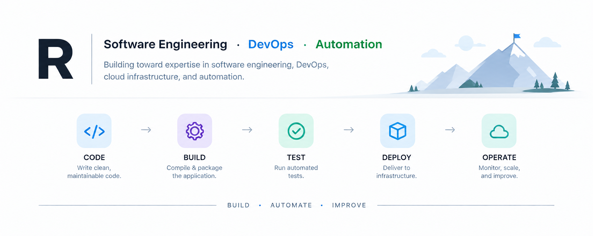
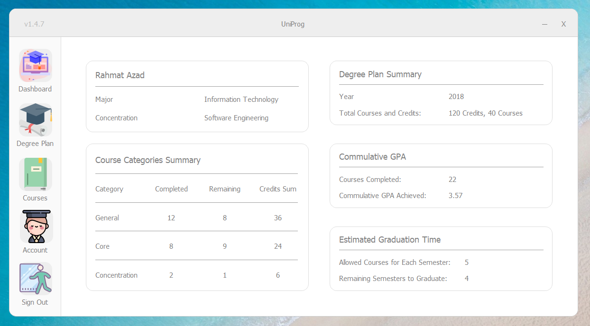

<p align="center">
  
</p>

## 👤 About

Building toward expertise in software engineering, DevOps, cloud infrastructure, and automation.

I enjoy understanding systems from code to deployment—and finding ways to make them more reliable, scalable, and automated.

## 🔭 Currently Exploring

- ☁️ Cloud Infrastructure
- ⚙️ DevOps & Automation
- 🐧 Linux & System Administration
- 🔐 Cybersecurity
- 🐍 Python & Software engineering

## 📁 Projects

### HydraDB

[](https://www.python.org/)
[](https://pypi.org/project/hydradb/)
[](https://opensource.org/licenses/MIT)

A lightweight Python API that simplifies common SQLite database operations.

#### Installation

```bash
pip install hydradb
```

#### Usage

```python
from hydra import Schema

db = Schema("myDB")

db.execute("SELECT * FROM students")
```

### UniProg

[](https://github.com/rhmtazad/UniProg/)
[](https://python.org)
[](https://www.gnu.org/licenses/gpl-3.0)

A GUI tool for students to manage degree plans and courses, developed as a Software Engineering project using Agile and Scrum.

<p align="center">
  
</p>

## 📜 Credentials

- 🛡️ Google Cybersecurity Professional Certificate
- 💻 Google IT Support Professional Certificate
- 🗄️ IBM Python for Data Science and AI

<!--START_SECTION:badges-->
<!--END_SECTION:badges-->
