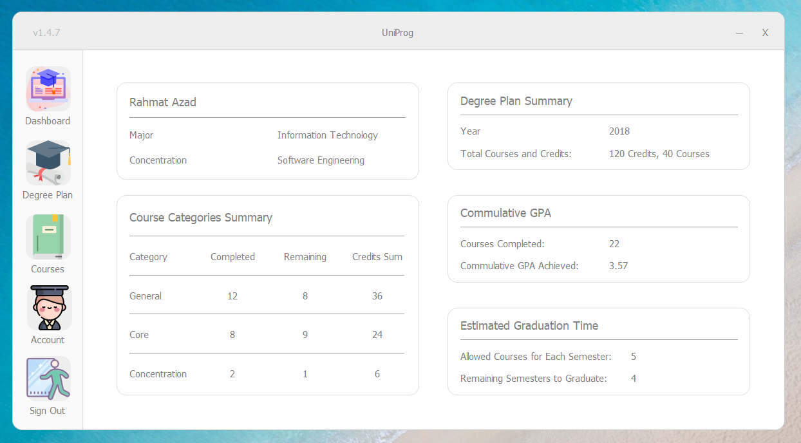

<p align="center">
  
</p>

## 👤 About

I build software, automate infrastructure, and solve technical problems.

## 🔭 Currently Exploring

- ☁️ Cloud Infrastructure
- ⚙️ DevOps & Automation
- 🐧 Linux & System Administration
- 🔐 Cybersecurity
- 🐍 Python & Software engineering

## 📁 Projects

### HydraDB

[](https://www.python.org/)
[](https://pypi.org/project/hydradb/)
[](https://opensource.org/licenses/MIT)

A lightweight Python API that simplifies common SQLite database operations.

#### Installation

```bash
pip install hydradb
```

#### Usage

```python
from hydra import Schema

db = Schema("myDB")

db.execute("SELECT * FROM students")
```

### UniProg

[](https://github.com/rhmtazad/UniProg/)
[](https://python.org)
[](https://www.gnu.org/licenses/gpl-3.0)

A GUI tool for students to manage degree plans and courses, developed as a Software Engineering project using Agile and Scrum.

<p align="center">
  
</p>

## 🎓 Credentials

- 🛡️ Google Cybersecurity Professional Certificate
- 💻 Google IT Support Professional Certificate
- 📊 Google Data Analytics Professional Certificate
- 🎨 Google UX Design Professional Certificate
- 🐍 Google IT Automation with Python Professional Certificate
- 🐍 IBM Python for Data Science, AI & Development  

<!--START_SECTION:badges-->
[](https://www.credly.com/badges/9b4d1e5c-be53-44e2-a1cd-c312502693ca)
[](https://www.credly.com/badges/e0e153c1-92ad-4643-8af2-414fb92736f2)
[](https://www.credly.com/badges/f77abbe0-72ab-4def-b801-172d73b398b2)
[](https://www.credly.com/badges/58d74682-616e-4aef-be32-36e66150aec7)
[](https://www.credly.com/badges/fbec0f71-57c2-4800-8391-14a8465cb4fc)
[](https://www.credly.com/badges/6d4e7949-12d3-402f-a3bf-ff9fac0efc4e)
[](https://www.credly.com/badges/78875b8c-5d6d-4fff-95cd-c5ee1affca53)
[](https://www.credly.com/badges/e83242b4-c863-482c-a9e3-aa557795d781)
[](https://www.credly.com/badges/eab6d303-9fa3-48b4-86e6-39644cbbd07f)
[](https://www.credly.com/badges/456c4f54-bb65-4ef7-8eb8-fc744f129033)
[](https://www.credly.com/badges/9eccb7d6-7e21-4c05-8f42-8dd105daa1bf)
[](https://www.credly.com/badges/145feedf-8d5e-45fe-bad6-c0662645beb1)
[](https://www.credly.com/badges/f3c19ffe-613d-4ab2-8786-5ca9eaa4d6f3)
[](https://www.credly.com/badges/0baeb562-64fc-4a52-a71e-643d2aca0ce1)
[](https://www.credly.com/badges/69af0782-b6cc-40fa-8f41-20b311877909)
[](https://www.credly.com/badges/1bc0a4bc-788b-4e6b-a212-7d83c4d42259)
[](https://www.credly.com/badges/ce35cdb8-65bc-4eeb-b3d9-59eb8edf6c07)
[](https://www.credly.com/badges/0ea84f38-4975-4361-9e95-189201de7aa3)
[](https://www.credly.com/badges/23fb48a9-0f4f-4086-8195-8f50fe6344d6)
[](https://www.credly.com/badges/5137df56-e75b-404d-b070-a13d5c5beddd)
[](https://www.credly.com/badges/6ed04358-db82-4a12-a7ed-fbdcee5bb6fd)
[](https://www.credly.com/badges/514a54cc-8f1b-4fc7-80cc-273e3eaf0dc4)
[](https://www.credly.com/badges/e60e8e95-980a-46ae-9fc5-ed9c8fee80de)
[](https://www.credly.com/badges/722fdaac-c990-4f95-82d6-51848b295c7e)
[](https://www.credly.com/badges/87049631-a3b8-4ab8-8ba5-7b539e6724c1)
[](https://www.credly.com/badges/29078a81-c22f-4752-925f-d56742bf85ef)
[](https://www.credly.com/badges/6610acfe-e454-49ca-b399-4e64bebf96ed)
[](https://www.credly.com/badges/98f91f78-1d2c-4d7c-bc84-a896f5d4ebe0)
[](https://www.credly.com/badges/ca8e777d-7596-466c-a519-efdb8860e2e7)
[](https://www.credly.com/badges/54fda7bf-eb40-4406-a2e3-193fa3c05ffa)
[](https://www.credly.com/badges/535a2e55-a0d9-4c1f-b195-775a6c0ccc27)
[](https://www.credly.com/badges/1fb90f78-74cd-40d8-aca0-45cd9279a1b3)
[](https://www.credly.com/badges/e2f318d6-2de1-4024-b2d4-027d162540a3)
[](https://www.credly.com/badges/797c0796-846b-44fa-a8af-d512b76b8a04)
[](https://www.credly.com/badges/b30e5e45-2979-4c82-a357-ec6fdeacd19a)
[](https://www.credly.com/badges/2767c0ca-3adc-49ca-8594-fa9d29973862)
<!--END_SECTION:badges-->
